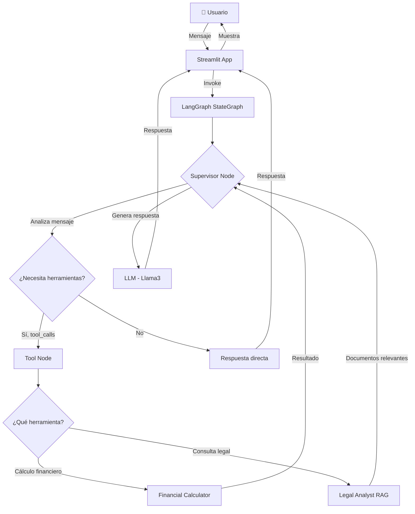
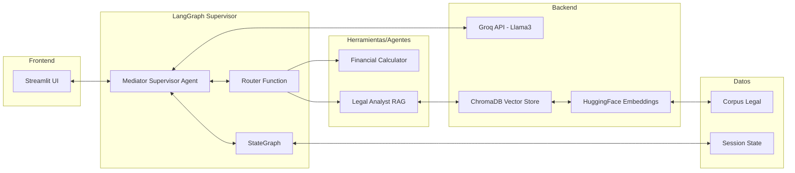
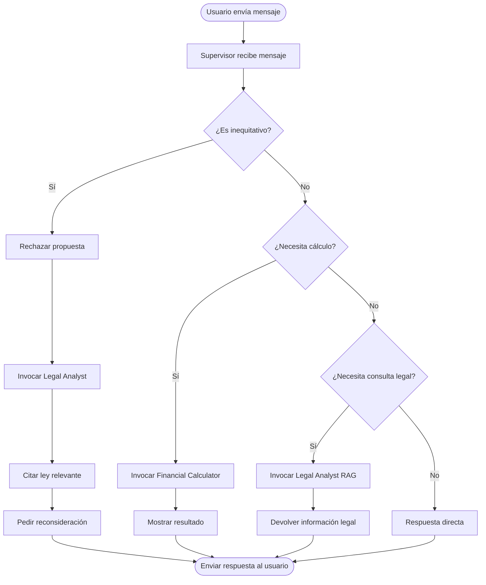
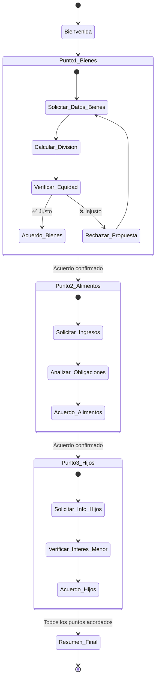
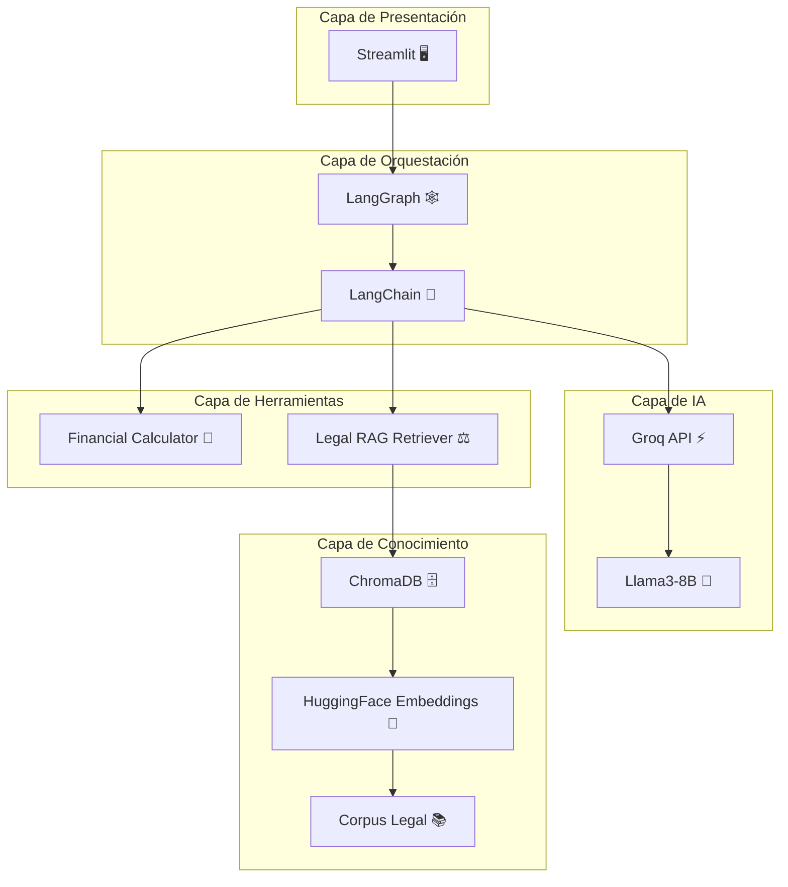
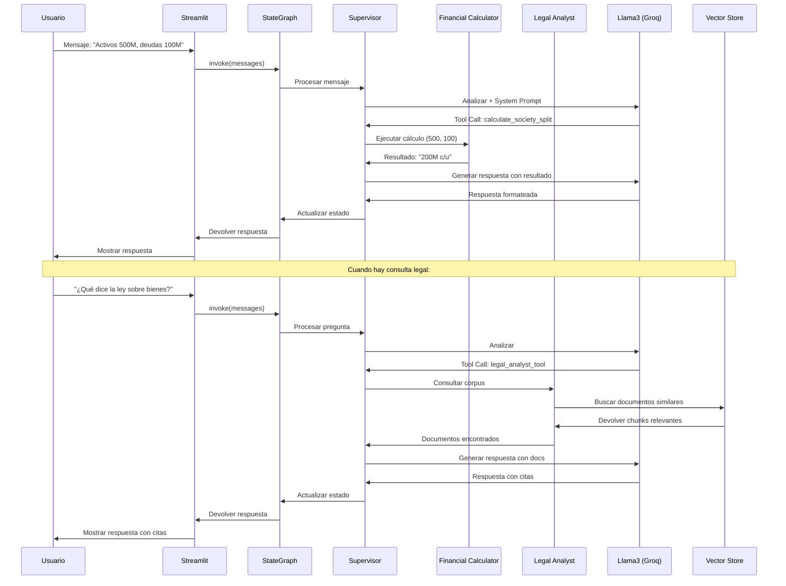
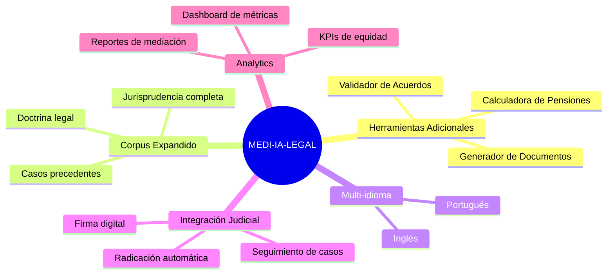

# 🏗️ ARQUITECTURA DEL SISTEMA MEDI-IA-LEGAL

## Diagrama de Flujo Principal

## Arquitectura de Componentes

## Flujo de Decisión del Supervisor

## Ciclo de Mediación (3 Puntos Nodales)

## Stack Tecnológico

## Flujo de Datos

---

## 📊 Métricas del Sistema

### Componentes Principales
- **1** Supervisor (Mediator_Supervisor_Agent)
- **2** Herramientas especializadas:
  - Financial_Calculator_Agent
  - Legal_Analyst_Agent (RAG)
- **3** Puntos nodales de mediación
- **3** Documentos en corpus legal

### Tecnologías
1. **LangGraph** - Orquestación de agentes
2. **LangChain** - Framework de LLM
3. **Groq** - Inferencia rápida de LLM
4. **Streamlit** - Frontend web
5. **ChromaDB** - Vector database
6. **HuggingFace** - Embeddings
7. **Python-dotenv** - Gestión de configuración
8. **Sentence Transformers** - Modelos de embeddings

### Características
- ✅ Arquitectura modular y extensible
- ✅ RAG sobre corpus legal personalizado
- ✅ Barrera ética de contención
- ✅ Estado persistente de conversación
- ✅ Interfaz intuitiva
- ✅ Respuestas fundamentadas en ley

---

## 🔄 Extensiones Futuras

---

## 💡 Principios de Diseño

1. **Modularidad**: Cada componente es independiente y reemplazable
2. **Transparencia**: Las decisiones del sistema están fundamentadas y explicadas
3. **Ética**: Barrera activa contra propuestas injustas
4. **Escalabilidad**: Fácil agregar nuevos agentes y herramientas
5. **User-Centric**: Interfaz simple y guía paso a paso

---

*Diagrama generado para MEDI-IA-LEGAL - Sistema de Mediación Inteligente*
